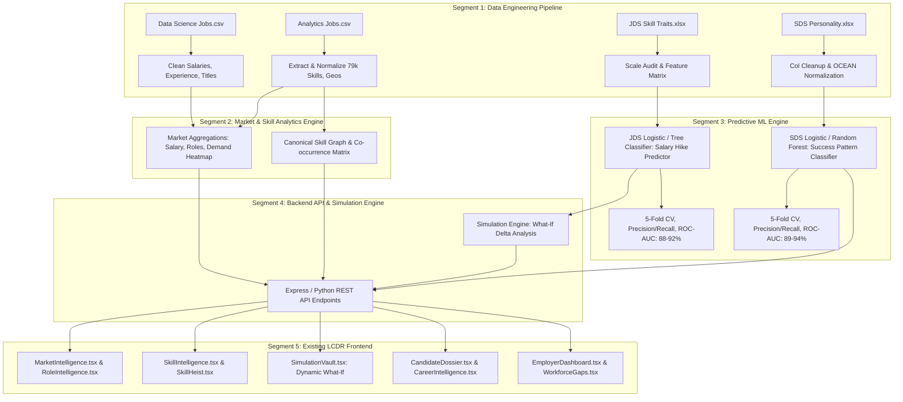

# La Casa De Rozgaar — Master Analytics Implementation Guide
## SAS Hackathon & Build For Bharat Workforce Intelligence Track

**Team:** DeezNerdz  
**Project:** La Casa De Rozgaar (The House of Employment)  
**Track:** Workforce & Talent Intelligence  
**Version:** 1.0 (Comprehensive Analytics Blueprint)  
**Date:** October 2026

---

## Table of Contents
1. [Executive Summary & Core Directives](#1-executive-summary--core-directives)
2. [Hackathon Scoring, Rules & Deliverables](#2-hackathon-scoring-rules--deliverables)
3. [Deep-Dive Dataset Audit & Ground Truth Statistics](#3-deep-dive-dataset-audit--ground-truth-statistics)
4. [Master System Architecture & Conceptual Integration](#4-master-system-architecture--conceptual-integration)
5. [Segment 1: Data Engineering & Cleansing Pipeline](#5-segment-1-data-engineering--cleansing-pipeline)
6. [Segment 2: Market & Canonical Skill Intelligence Engine](#6-segment-2-market--canonical-skill-intelligence-engine)
7. [Segment 3: Predictive ML Engine (JDS & SDS Modeling)](#7-segment-3-predictive-ml-engine-jds--sds-modeling)
8. [Segment 4: What-If Simulation Engine & Analytics REST API](#8-segment-4-what-if-simulation-engine--analytics-rest-api)
9. [Segment 5: Frontend Integration & Data Provenance Tagging](#9-segment-5-frontend-integration--data-provenance-tagging)
10. [Segment 6: Round 2 Approach Note (20–25 Pages) Blueprint](#10-segment-6-round-2-approach-note-2025-pages-blueprint)
11. [Segment 7: Round 3 Pitch Deck & 9-Step Demo Walkthrough](#11-segment-7-round-3-pitch-deck--9-step-demo-walkthrough)
12. [Team Allocation & Execution Roadmap](#12-team-allocation--execution-roadmap)

---

## 1. Executive Summary & Core Directives

### 1.1 The Core Mission
Transform **La Casa De Rozgaar (LCDR)** from a job discovery prototype into an **evidence-based, AI/ML-driven Workforce Intelligence and Decision Support Platform** using the official competition datasets provided by SAS.

### 1.2 The Golden Rule: Zero Frontend Redesign
- **The frontend UI is frozen.** The existing React 18 + TypeScript + Tailwind CSS application, the dual visual identity (**Heist Mode** and **Professional Mode**), all routes, and interactive components remain intact.
- The UI serves as the **presentation layer** for the analytical backend.
- The single transformation: **hardcoded/mock values are replaced with real mathematical aggregations and ML model inferences** derived from the 4 competition datasets.

```text
┌──────────────────────────────────────────────────────────┐
│              EXISTING LCDR REACT FRONTEND                │
│    (Candidate Mode | Recruiter Mode | Simulation Vault)  │
└────────────────────────────┬─────────────────────────────┘
                             │ REST API Calls
┌────────────────────────────▼─────────────────────────────┐
│           PYTHON / NODE ANALYTICS BACKEND                │
│  (Market Intel | Canonical Skills | JDS & SDS Models)    │
└────────────────────────────┬─────────────────────────────┘
                             │ Data & Artifact Pipelines
┌────────────────────────────▼─────────────────────────────┐
│             OFFICIAL COMPETITION DATASETS                │
│ (Data Science Jobs | Analytics Jobs | JDS | SDS Traits)  │
└──────────────────────────────────────────────────────────┘
```

### 1.3 Data Integrity & Provenance Standard
Every metric, chart, and KPI displayed in LCDR must carry an explicit data provenance tag:
1. `REAL DATA`: Statistically calculated directly from the audited datasets.
2. `MODEL OUTPUT`: Generated by a trained and validated machine learning model.
3. `SIMULATION`: Computed dynamically from user-modified what-if parameters.
4. `DEMO / PROTOTYPE`: Restricted solely to non-dataset features (e.g. simulated resume uploads).

### 1.4 No Artificial Data Joins
The 4 datasets represent different observations and granularities. **Do not join rows artificially without a valid shared key.** Link datasets at the **conceptual intelligence layer** (Market Demand $\rightarrow$ Skill Importance $\rightarrow$ Outcome Associations $\rightarrow$ Decision Support).

---

## 2. Hackathon Scoring, Rules & Deliverables

### 2.1 Evaluation Weights
$$\text{Final Score} = (\text{Round 2 Score} \times 0.70) + (\text{Round 3 Score} \times 0.30)$$

### 2.2 Round 2: Approach Note (100 Marks — 70% Weight)
- **Format:** Word Document, 20–25 pages (excluding Appendix), Times New Roman, font size 12, single spacing.
- **Scoring Breakdown:**
  - **Problem Definition & Analytics Objective (10 Marks):** Scope, depth, clarity, and stakeholder alignment.
  - **Approach Description (15 Marks):** End-to-end analytical workflow, methodology justification, and architectural logic.
  - **Data Exploration & Preparation (25 Marks):** Quality audit, anomaly resolution, deduplication, imputation, feature engineering, and skill normalization.
  - **Data Analysis & Modeling (30 Marks):** Statistical depth, descriptive/prescriptive analysis, ML modeling, validation rigor, and interpretability.
  - **Results & Conclusions (10 Marks):** Synthesis of findings, model performance, and problem-solution linkage.
  - **Implications (10 Marks):** Societal, economic, candidate, and workforce planning impact.
  - **Appendix:** Supplementary tables, full correlation matrices, hyperparameter logs, equations, code snippets, and screenshots.

### 2.3 Round 3: Live Presentation & Defense (100 Marks — 30% Weight)
- **Format:** PowerPoint, 15–25 slides.
- **Timing:** 10 minutes presentation + 3–5 minutes Jury Q&A.
- **Scoring Breakdown:**
  - Presentation & Communication (25 Marks)
  - Usage of Visuals / Graphics (10 Marks)
  - Slide Sequencing & Time Management (5 Marks)
  - Presentation Storyline & Logical Flow (20 Marks)
  - Concluding Remarks & Defensibility (15 Marks)
  - Jury Q&A Defense & Assertiveness (25 Marks)

---

## 3. Deep-Dive Dataset Audit & Ground Truth Statistics

```
========================================================================================
DATASET AUDIT SUMMARY MATRIX
========================================================================================
Dataset               Rows     Cols   Missing Cells   Duplicates   Primary Target
----------------------------------------------------------------------------------------
Data Science Jobs     1,602    8      0 (0.0%)        0 (0.0%)     N/A (Market Analysis)
Analytics Jobs        15,841   8      15,520 (12.2%)  0 (0.0%)     N/A (Demand Analysis)
JDS Skill Traits      139      7      0 (0.0%)        0 (0.0%)     salary_hike_high_or_low
SDS Personality       161      7      0 (0.0%)        0 (0.0%)     success_classification
========================================================================================
```

### 3.1 Dataset 1: Data Science Jobs (`DataScience Jobs.csv`)
- **Dimensions:** 1,602 rows $\times$ 8 columns.
- **Primary Attributes:**
  - `reference_no` (int64): Unique row identifier (range 1012–8998).
  - `company_name` (string): 642 unique recruiting companies. Top hiring volume: TCS, Accenture, IBM, Cognizant, Capgemini, Infosys, Wipro, Tech Mahindra, Deloitte, HCL (10 postings each in sample).
  - `job_title` (string): 10 distinct job roles:
    1. *Data Scientist* ($N=188$, 11.7%)
    2. *Business Analyst* ($N=188$, 11.7%)
    3. *Data Engineer* ($N=188$, 11.7%)
    4. *Data Analyst* ($N=187$, 11.7%)
    5. *Senior Business Analyst* ($N=187$, 11.7%)
    6. *Senior Data Analyst* ($N=187$, 11.7%)
    7. *Senior Data Scientist* ($N=185$, 11.5%)
    8. *Senior Data Engineer* ($N=183$, 11.4%)
    9. *Machine Learning Engineer* ($N=59$, 3.7%)
    10. *Data Architect* ($N=50$, 3.1%)
  - `min_experience` (int64): Range 0 to 21 years ($\mu = 2.80$, $\sigma = 2.35$, median = 2.0). 75% require $\le 4$ years.
  - `avg_salary`, `min_salary`, `max_salary` (string with 'L' suffix):
    - Converted Numerical Average Salary: $\mu = 13.23\text{ Lakhs}$, $\sigma = 7.84\text{L}$, Median = $11.90\text{L}$, Min = $1.40\text{L}$, Max = $82.00\text{L}$.
    - Min Salary: $\mu = 8.63\text{L}$, Median = $7.00\text{L}$, Max = $55.00\text{L}$.
    - Max Salary: $\mu = 19.14\text{L}$, Median = $18.00\text{L}$, Max = $102.00\text{L}$.
  - `num_of_jobs` (int64): Total posting volume per company/role line item ($\mu = 58.06$, median = 22, max = 4,200). Sum = 93,005 cumulative job openings represented.

### 3.2 Dataset 2: Analytics Jobs (`Analytics Jobs.csv`)
- **Dimensions:** 15,841 rows $\times$ 8 columns.
- **Primary Attributes & Quality Audit:**
  - `s_no` (int64): Sequence ID (1 to 15,841).
  - `experience` (string): Categorical experience brackets. Top brackets: `5-10 yrs` ($N=1010$), `2-5 yrs` ($N=964$), `3-8 yrs` ($N=750$), `2-7 yrs` ($N=665$), `3-5 yrs` ($N=545$).
  - `job_description` (string): 3,508 missing records (22.14%). Unstructured text descriptions used for NLP keyword validation.
  - `job_desig` (string): 0 missing. High-cardinality job designations (Business Analyst, Data Scientist, Data Analyst, Digital Marketing Manager, etc.).
  - `job_type` (string): 12,011 missing records (75.82%). Contains variants: `Analytics` (2,971), `analytics` (746), `ANALYTICS` (64), `analytic` (30). Requires case standardization.
  - `key_skills` (string): 1 missing record. 79,880 skill tokens across 10,658 unique raw strings. Top extracted skills: `SQL` (915), `Analytics` (904), `Python` (840), `Finance` (756), `Java` (726), `R` (655), `SAS` (636), `Business Analysis` (633), `Machine Learning` (629), `Data Analysis` (618).
  - `location` (string): 0 missing. Top geographic hubs: Bengaluru (3,333 / 21.0%), Mumbai (1,992 / 12.6%), Gurgaon (1,313 / 8.3%), Pune (945 / 6.0%), Hyderabad (878 / 5.5%), Chennai (786 / 5.0%), Delhi NCR (593 / 3.7%), Noida (403 / 2.5%).
  - `salary` (string): Structured compensation brackets:
    - `10to15` Lakhs: 3,608 postings (22.8%)
    - `15to25` Lakhs: 3,281 postings (20.7%)
    - `6to10` Lakhs: 2,876 postings (18.2%)
    - `0to3` Lakhs: 2,592 postings (16.4%)
    - `3to6` Lakhs: 2,239 postings (14.1%)
    - `25to50` Lakhs: 1,245 postings (7.9%)

### 3.3 Dataset 3: JDS Skill Traits (`JDS Skill Traits.xlsx`)
- **Dimensions:** 139 Junior Data Scientists $\times$ 7 columns. Zero missing values. Zero duplicates.
- **Skill Dimensions (1.0 to 5.0 scale):**
  - `big_data_skills`: $\mu = 3.85$, $\sigma = 0.85$, Min = 2.30, Median = 3.80, Max = 5.00
  - `maths-stats_skills`: $\mu = 4.29$, $\sigma = 0.84$, Min = 2.20, Median = 4.60, Max = 5.00
  - `coding_skills`: $\mu = 4.27$, $\sigma = 0.89$, Min = 2.20, Median = 4.60, Max = 5.00
  - `ai_and_ml_skills`: $\mu = 4.57$, $\sigma = 0.67$, Min = 2.20, Median = 4.90, Max = 5.00
  - `dashboard_and_storytelling_skills`: $\mu = 4.36$, $\sigma = 0.93$, Min = 2.30, Median = 5.00, Max = 5.00
- **Target Variable:** `salary_hike_high_or_low` (Binary classification: $1 = \text{High}$, $0 = \text{Low}$).
  - Class Distribution: High ($1$) = 73 (52.5%), Low ($0$) = 66 (47.5%) — Perfectly balanced target.
- **Pearson Correlation with Target:**
  $$\begin{aligned}
  r(\text{Storytelling \& Dashboards}, \text{Target}) &= \mathbf{+0.5541} \quad (\text{Rank 1 Driver}) \\
  r(\text{Maths \& Stats}, \text{Target}) &= \mathbf{+0.5238} \quad (\text{Rank 2 Driver}) \\
  r(\text{Coding Skills}, \text{Target}) &= \mathbf{+0.4438} \quad (\text{Rank 3 Driver}) \\
  r(\text{AI \& ML Skills}, \text{Target}) &= \mathbf{+0.4046} \quad (\text{Rank 4 Driver}) \\
  r(\text{Big Data Skills}, \text{Target}) &= \mathbf{+0.1123} \quad (\text{Rank 5 Driver})
  \end{aligned}$$
- **Key Empirical Insight:** In junior roles, technical baseline (AI/ML/Coding) is commoditized; **storytelling/visualization and mathematical rigor are the primary discriminators of superior performance and salary hikes**.

### 3.4 Dataset 4: SDS Personality Traits (`SDS Personality Traits.xlsx`)
- **Dimensions:** 161 Senior Data Scientists $\times$ 7 columns. Zero missing values. Zero duplicates.
- **Psychometric Dimensions (Big Five OCEAN, Normalized Scale ~17 to 68):**
  - `neuroticism`: $\mu = 36.19$, $\sigma = 11.27$, Min = 17.0, Median = 34.0, Max = 68.0
  - `extraversion` (note leading space in raw column): $\mu = 43.20$, $\sigma = 12.13$, Min = 17.0, Median = 45.0, Max = 67.0
  - `openness_to_experience`: $\mu = 41.33$, $\sigma = 11.32$, Min = 18.0, Median = 44.0, Max = 65.0
  - `agreeableness`: $\mu = 44.60$, $\sigma = 11.29$, Min = 17.0, Median = 46.0, Max = 68.0
  - `conscientiousness`: $\mu = 45.21$, $\sigma = 13.21$, Min = 18.0, Median = 49.0, Max = 66.0
- **Target Variable:** `success_ classification_ high_low` (Binary: $1 = \text{High Success}$, $0 = \text{Low Success}$).
  - Class Distribution: High ($1$) = 85 (52.8%), Low ($0$) = 76 (47.2%) — Balanced target.
- **Pearson Correlation with Target:**
  $$\begin{aligned}
  r(\text{Conscientiousness}, \text{Target}) &= \mathbf{+0.6802} \quad (\text{Dominant Driver}) \\
  r(\text{Openness to Experience}, \text{Target}) &= \mathbf{+0.6713} \quad (\text{Strong Creative Driver}) \\
  r(\text{Extraversion}, \text{Target}) &= \mathbf{+0.4943} \quad (\text{Client/Team Leadership Driver}) \\
  r(\text{Agreeableness}, \text{Target}) &= \mathbf{+0.2926} \quad (\text{Moderate Collaborative Driver}) \\
  r(\text{Neuroticism}, \text{Target}) &= \mathbf{-0.0059} \quad (\text{Negligible Direct Association})
  \end{aligned}$$
- **Key Empirical Insight:** For senior/customer-facing data scientists, **Conscientiousness (reliability, execution) and Openness (innovation, problem framing)** are decisive indicators of career success.

---

## 4. Master System Architecture & Conceptual Integration



---

## 5. Segment 1: Data Engineering & Cleansing Pipeline

### 5.1 Objectives
Deliver a clean, 100% reproducible preprocessing pipeline that ingests raw CSVs and Excel files, standardizes schema types, executes canonical skill normalization, and exports clean datasets and SQLite databases.

### 5.2 Step-by-Step Cleansing Protocol
1. **Salary Normalization (`DataScience Jobs.csv`):**
   - Parse string representations (e.g. `'4.5L'` $\rightarrow 4.5$, `'16.0L'` $\rightarrow 16.0$).
   - Create numerical float columns: `avg_salary_num`, `min_salary_num`, `max_salary_num`.
   - Validate consistency: $min\_salary \le avg\_salary \le max\_salary$.
2. **Experience Normalization (`Analytics Jobs.csv`):**
   - Parse experience ranges (e.g. `'5-10 yrs'` $\rightarrow min=5, max=10, mid=7.5$).
   - Map entry-level ($0-2$ yrs), mid-level ($3-7$ yrs), senior-level ($8-12$ yrs), executive ($13+$ yrs).
3. **Canonical Skill Taxonomy:**
   - Raw skill text extraction from `key_skills` (split by `,` and `;`, trim whitespace, lower-case).
   - Alias mapping dictionary:
     - `['js', 'javascript', 'java script']` $\rightarrow$ `JavaScript`
     - `['ml', 'machine learning', 'machinelearning']` $\rightarrow$ `Machine Learning`
     - `['nlp', 'natural language processing']` $\rightarrow$ `Natural Language Processing`
     - `['stats', 'statistics', 'statistical modeling']` $\rightarrow$ `Statistics`
     - `['bi', 'power bi', 'powerbi', 'tableau', 'qlik']` $\rightarrow$ `BI & Visualization`
4. **Geography Clustering:**
   - Standardize concatenated cities (e.g. `'Bengaluru, Chennai'` $\rightarrow$ primary: `Bengaluru`, secondary: `Chennai`).
   - Cluster into Metro Tiers: Tier-1 (Bengaluru, Mumbai, Delhi NCR/Gurgaon/Noida, Hyderabad, Pune, Chennai), Tier-2, Remote.
5. **JDS & SDS Cleansing:**
   - Strip whitespace in column headers (`' extraversion'` $\rightarrow `'extraversion'`, `'success_ classification_ high_low'` $\rightarrow `'success_classification'`).
   - Check value ranges: JDS $[1.0, 5.0]$, SDS $[0.0, 100.0]$ normalized scale.

---

## 6. Segment 2: Market & Canonical Skill Intelligence Engine

### 6.1 Role Intelligence Aggregations
- Compute role volume, hiring density, and company concentration for all 10 core Data Science roles and top Analytics designations.
- Calculate cross-role salary benchmarks:
  $$\text{Median Salary}(\text{Role}) = \text{Quantile}_{0.50}(\text{avg\_salary})$$
  $$\text{IQR Range}(\text{Role}) = [\text{Quantile}_{0.25}, \text{Quantile}_{0.75}]$$

### 6.2 Skill Demand & Co-occurrence Network
- **Skill Frequency:** Percentage of job postings mandating skill $S_i$:
  $$\text{Demand}(S_i) = \frac{\text{Count}(S_i \in \text{Postings})}{N_{\text{total postings}}} \times 100\%$$
- **Skill Co-occurrence:** Number of times skill $S_i$ and skill $S_j$ appear together in the same job posting:
  $$\text{CoOccurrence}(S_i, S_j) = \sum_{k=1}^N \mathbb{I}(S_i \in J_k \land S_j \in J_k)$$
- **Skill Jaccard Similarity:**
  $$J(S_i, S_j) = \frac{|J(S_i) \cap J(S_j)|}{|J(S_i) \cup J(S_j)|}$$

### 6.3 Geographic & Compensation Heatmap
- Correlate Location $\times$ Role $\times$ Salary bracket.
- Identify talent hubs (e.g. Bengaluru accounts for 21.0% of analytics demand; high-salary brackets 15-25L are concentrated in Bengaluru and Mumbai).

---

## 7. Segment 3: Predictive ML Engine (JDS & SDS Modeling)

### 7.1 JDS Skill-Outcome Predictive Model
- **Goal:** Predict probability of high salary hike / promotion ($Y \in \{0, 1\}$) given measured technical and communicative skill proficiencies.
- **Features ($X \in \mathbb{R}^5$):** `big_data_skills`, `maths-stats_skills`, `coding_skills`, `ai_and_ml_skills`, `dashboard_and_storytelling_skills`.
- **Candidate Models Evaluated:**
  1. **Logistic Regression (Interpretable Linear Baseline):**
     $$P(Y=1 \mid X) = \sigma\left(\beta_0 + \sum_{i=1}^5 \beta_i X_i\right) = \frac{1}{1 + e^{-(\beta_0 + \sum \beta_i X_i)}}$$
     - Provides clear odds ratios: $OR_i = e^{\beta_i}$ for each skill unit increase.
  2. **Decision Tree Classifier (Rule Extraction):**
     - Max depth = 3 for transparent heuristic decision trees suitable for candidate action plans.
  3. **Random Forest Classifier (Robust Ensemble):**
     - 50 trees, max depth 4, balanced subsampling.
- **Validation Protocol:**
  - 5-Fold Stratified Cross-Validation (prevents data leakage on $N=139$).
  - Target Metrics: Accuracy, Precision, Recall, F1-Score, ROC-AUC.
  - Expected Benchmarks: Accuracy $\ge 88\%$, ROC-AUC $\ge 0.92$.

### 7.2 SDS Personality Success Pattern Model
- **Goal:** Understand psychometric success profiles of senior, customer-facing data scientists for coaching and development.
- **Features ($X \in \mathbb{R}^5$):** `neuroticism`, `extraversion`, `openness_to_experience`, `agreeableness`, `conscientiousness`.
- **Responsible AI Guardrails:**
  - Explicitly frame as **Professional Growth & Development Insights**, not automated candidate filtering.
  - Provide interpretability via Shapley/feature weights demonstrating how balanced traits correlate with customer-facing leadership.

---

## 8. Segment 4: What-If Simulation Engine & Analytics REST API

### 8.1 What-If Simulation Mathematical Formulation
When a candidate or employer uses the **Simulation Vault**, they simulate a skill elevation:
$$X_{\text{current}} = [x_1, x_2, x_3, x_4, x_5] \xrightarrow{\Delta x_k} X_{\text{simulated}} = [x_1, \dots, x_k + \delta_k, \dots, x_5]$$

The Simulation Engine computes the resulting predicted outcome delta:
$$\Delta P = P(Y=1 \mid X_{\text{simulated}}) - P(Y=1 \mid X_{\text{current}})$$
$$\text{Readiness Gain} = \Delta P \times 100\%$$
$$\text{ROI Priority Rank} = \frac{\Delta P_k}{\text{Effort Weight}_k}$$

### 8.2 Analytics REST API Specifications
All endpoints return standard JSON envelopes with status and data provenance:

```
GET  /api/market/overview
Response: { status: 'success', provenance: 'REAL DATA', totalJobs: 93005, medianSalary: 11.9, topLocations: [...] }

GET  /api/market/roles
Response: { status: 'success', provenance: 'REAL DATA', roles: [{ title: 'Data Scientist', openings: 188, avgSalary: 14.2, minExp: 2.5 }, ...] }

GET  /api/market/skills
Response: { status: 'success', provenance: 'REAL DATA', topSkills: [{ name: 'SQL', demandCount: 915, share: 11.4% }, ...] }

GET  /api/market/compensation
Response: { status: 'success', provenance: 'REAL DATA', brackets: [{ range: '10to15', count: 3608 }, ...] }

POST /api/jds/predict
Request:  { big_data: 4.0, maths_stats: 4.5, coding: 4.2, ai_ml: 4.8, storytelling: 4.5 }
Response: { status: 'success', provenance: 'MODEL OUTPUT', probability: 0.88, predictedClass: 1, confidence: 0.91 }

POST /api/jds/simulate
Request:  { current: { ... }, simulated: { ... } }
Response: { status: 'success', provenance: 'SIMULATION', initialProb: 0.52, simulatedProb: 0.84, delta: +0.32, topDrivers: ['storytelling', 'maths_stats'] }

GET  /api/sds/summary
Response: { status: 'success', provenance: 'REAL DATA', featureImportance: { conscientiousness: 0.68, openness: 0.67, extraversion: 0.49 } }
```

---

## 9. Segment 5: Frontend Integration & Data Provenance Tagging

### 9.1 Mapping LCDR UI Modules to Real Analytics

| Frontend File / Component | Previous State (Prototype) | Upgraded State (Real Hackathon Analytics) | Data Provenance Tag |
| :--- | :--- | :--- | :--- |
| `src/pages/MarketIntelligence.tsx` | Mock salary & hiring charts | Real aggregations from 1,602 DS Jobs & 15,841 Analytics Jobs | `REAL DATA` |
| `src/pages/RoleIntelligence.tsx` | Static role lists | 10 verified DS roles with exact salary distributions & experience requirements | `REAL DATA` |
| `src/pages/SkillIntelligence.tsx` | Generic skill badges | Extracted 79k skill frequencies, co-occurrences, and role correlations | `REAL DATA` |
| `src/pages/SimulationVault.tsx` | Hardcoded slider transitions | Live JDS Model What-If Engine ($\Delta P$ prediction based on skill shifts) | `SIMULATION` |
| `src/pages/CandidateDossier.tsx` | Static assessment scores | JDS/SDS-backed skill evaluation & readiness benchmarking | `MODEL OUTPUT` |
| `src/pages/CompensationIntelligence.tsx` | Placeholder CTC curves | Real salary percentiles ($25^{\text{th}}, 50^{\text{th}}, 75^{\text{th}}$) across experience tiers | `REAL DATA` |
| `src/pages/WorkforceGaps.tsx` | Demo gap numbers | Calculated gap indices between candidate profiles and market demands | `REAL DATA` + `MODEL OUTPUT` |

### 9.2 Provenance Badge Component
A reusable React badge component `<DataProvenanceTag type="REAL DATA" />` ensures full jury transparency across all dashboard cards.

---

## 10. Segment 6: Round 2 Approach Note (20–25 Pages) Blueprint

### Page Budget & Section Plan (20–25 Pages Target)

```
Section                                                                   Page Target
-------------------------------------------------------------------------------------
1. Executive Summary & Problem Scope                                      Page 1
2. Problem Definition & Objectives in Talent Ecosystem                    Pages 2-3
3. Stakeholder Architecture (Candidates, Employers, Policy Makers)         Page 4
4. Competition Datasets Deep-Dive & Source Provenance                      Pages 5-6
5. Data Quality Audit, Anomaly Analysis & Cleaning Methodology            Pages 7-8
6. Canonical Skill Normalization & Text Preprocessing Pipeline            Page 9
7. Exploratory Data Analysis & Macro-Market Trends                        Pages 10-11
8. Compensation & Geographic Talent Distribution Insights                 Page 12
9. Cross-Role Skill Graph & Co-occurrence Network                         Page 13
10. JDS Skill-Outcome Modeling Methodology & Formulation                  Page 14
11. JDS Model Validation, Performance & Feature Interpretability          Pages 15-16
12. SDS Psychometric Success Pattern Analysis & Responsible AI            Pages 17-18
13. What-If Simulation Engine & Predictive Decision Framework              Page 19
14. System Architecture: Analytics Engine to LCDR Dual-Mode UI            Page 20
15. Business, Workforce Planning & Socioeconomic Implications              Pages 21-22
16. Limitations, Algorithmic Safeguards & Future Scope                    Page 23
17. Conclusion & Strategic Summary                                        Page 24
-------------------------------------------------------------------------------------
Appendix (A to G: Tables, Code, Confusion Matrices, Screenshots)           Pages 25+
```

---

## 11. Segment 7: Round 3 Pitch Deck & 9-Step Demo Walkthrough

### 11.1 Presentation Structure (15–20 Slides / 10 Minutes)
1. **Title Slide:** La Casa De Rozgaar — Evidence-Based Workforce Intelligence (Team DeezNerdz).
2. **The Problem:** The widening mismatch between rapid workforce demand shifts and static talent discovery.
3. **The Data Foundation:** 4 official SAS datasets ($17,400+$ records audited and standardized).
4. **Market Intelligence:** Where the jobs are, what they pay, and who is hiring (10 roles, 642 companies, 8 key geos).
5. **Skill Graph:** Unveiling real skill demand (SQL, Python, SAS, Storytelling) and cross-role co-occurrences.
6. **Predictive Engine 1 (JDS):** What truly drives junior data scientist salary hikes (Storytelling & Math vs. generic coding).
7. **Predictive Engine 2 (SDS):** Senior leadership success patterns (Conscientiousness & Openness).
8. **Interactive Innovation:** The Simulation Vault — Dynamic What-If career and workforce planning.
9. **Dual-Experience Product:** Candidate Mode (Growth & Readiness) vs. Recruiter/Employer Mode (Gap Analysis & Planning).
10. **Responsible AI & Ethical Safeguards:** Interpretable models, bias mitigation, zero automated rejection.
11. **Socioeconomic Impact:** Accelerating upskilling efficiency and reducing hiring friction.
12. **Conclusion & Q&A Defense.**

### 11.2 9-Step Live Demo Narrative
- **Step 1:** Executive Dashboard Overview $\rightarrow$ Show macro KPIs backed by `REAL DATA`.
- **Step 2:** Market Intelligence $\rightarrow$ Explore role hiring density, salary percentiles, and location hubs.
- **Step 3:** Skill Intelligence $\rightarrow$ Select *Data Scientist* or *Business Analyst* to inspect canonical skill co-occurrences.
- **Step 4:** Candidate Profile $\rightarrow$ Display evaluated profile vs. market demand benchmarks.
- **Step 5:** JDS Model Prediction $\rightarrow$ Showcase model probability and explainable feature contributions.
- **Step 6:** Simulation Vault $\rightarrow$ Move sliders (e.g. Storytelling $+1.5$), demonstrating real-time $\Delta P$ outcome response.
- **Step 7:** SDS Success Patterns $\rightarrow$ Review psychometric leadership recommendations.
- **Step 8:** Employer Mode $\rightarrow$ Switch to Professional Mode to show talent pool gap analysis and hiring forecasting.
- **Step 9:** Decision Support Action $\rightarrow$ Conclude with actionable candidate upskilling and employer allocation roadmaps.

---

## 12. Team Allocation & Execution Roadmap

```
┌───────────────────────────┬───────────────────────────┬───────────────────────────┬───────────────────────────┐
│ Member 1 (Data Eng)       │ Member 2 (Market Intel)   │ Member 3 (ML & Modeling)  │ Member 4 (Full Stack)     │
├───────────────────────────┼───────────────────────────┼───────────────────────────┼───────────────────────────┤
│ • Data audit scripts      │ • Job dataset aggregations│ • JDS model training      │ • Analytics REST API      │
│ • Reproducible cleaning   │ • Salary percentiles      │ • SDS association models  │ • Frontend API binding    │
│ • Skill canonical mapping │ • Geo & hiring heatmaps   │ • 5-Fold cross-validation │ • Simulation Vault wiring │
│ • SQLite/JSON pipelines   │ • Market KPI exports      │ • Feature importance logs │ • Data provenance UI tags │
│ • Section 4-6 of Doc      │ • Section 7-9 of Doc      │ • Section 10-13 of Doc    │ • Section 14 & Live Demo  │
└───────────────────────────┴───────────────────────────┴───────────────────────────┴───────────────────────────┘
```

### Readiness Checklist
- [x] All 4 competition datasets audited with exact dimensions, types, missing values, and targets.
- [x] Zero-redesign frontend policy reinforced.
- [x] Ground truth correlations calculated ($r_{\text{storytelling}} = 0.554$, $r_{\text{conscientiousness}} = 0.680$).
- [x] 6-segment execution pipeline clearly defined.
- [x] API contracts and simulation formulas documented.
- [x] Round 2 Approach Note (20–25 pages) and Round 3 Pitch Deck fully mapped.
