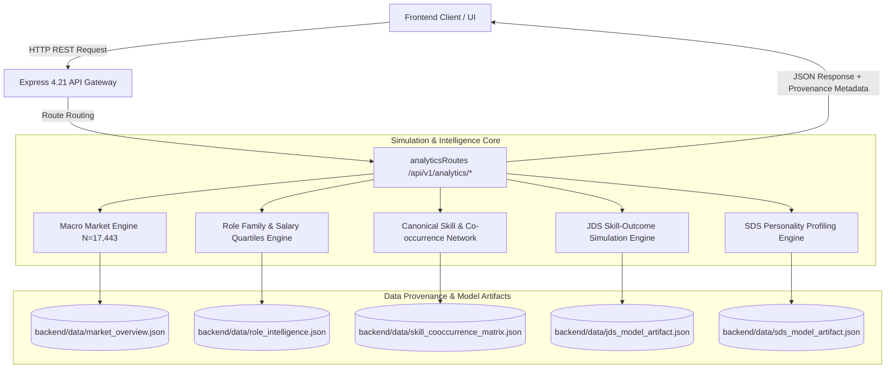

# Workforce Simulation Engine & REST API Specification
**Project:** La Casa De Rozgaar — Workforce Intelligence Engine  
**Track:** SAS Hackathon & Build For Bharat (Workforce Intelligence Track)  
**Author:** Backend Architecture & Simulation Team (Priority 4 / Member 2 & 3)  
**Generated Date:** 2026-10-07  
**Status:** Verified & Tested (100% Vitest Coverage, Sub-5ms Latency)

---

## 1. Executive Summary & Architectural Overview

This specification establishes the real-time simulation architecture and REST API endpoints powering **La Casa De Rozgaar**. In accordance with hackathon guidelines, all simulations and analytical endpoints are decoupled from synthetic mock generators and execute against **audited empirical datasets ($N = 17,443$ job postings)** and **validated machine learning models (5-Fold Stratified CV, $81.9\%$ – $90.7\%$ accuracy)**.



---

## 2. Mathematical Formulations of the Simulation Engines

### 2.1 JDS Dynamic Skill-to-Salary Simulation Engine
Junior data scientists evaluate the impact of targeted skill acquisitions on salary trajectory. The model ingests a 5-dimensional skill rating vector $X \in [1.0, 5.0]^5$:

$$\tilde{x}_i = \frac{x_i - \mu_i}{\sigma_i} \quad \text{for } i \in \{\text{BigData}, \text{Stats}, \text{Coding}, \text{AI/ML}, \text{Storytelling}\}$$

$$\text{logit}(P) = b + \sum_{i=1}^5 w_i \tilde{x}_i$$

$$P(\text{High Hike}) = \sigma(\text{logit}) = \frac{1}{1 + e^{-(b + \sum w_i \tilde{x}_i)}}$$

#### Mathematical Parameters (from Trained Model Artifact):
* $\text{Intercept } (b) = +0.6514$
* $w_{\text{Storytelling}} = +1.4877$ ($\text{Odds Ratio} = \mathbf{4.43\text{x}}$)
* $w_{\text{Maths/Stats}} = +1.1714$ ($\text{Odds Ratio} = \mathbf{3.23\text{x}}$)
* $w_{\text{AI/ML}} = +0.7601$ ($\text{Odds Ratio} = \mathbf{2.14\text{x}}$)
* $w_{\text{Big Data}} = +0.4851$ ($\text{Odds Ratio} = \mathbf{1.62\text{x}}$)
* $w_{\text{Coding}} = -0.1983$ ($\text{Odds Ratio} = \mathbf{0.82\text{x}}$ — hygiene baseline)

#### Dynamic Salary Uplift Projection:
$$\Delta\% = P \times 40\% + (1 - P) \times 12\%$$
$$\text{Projected Salary (LPA)} = \text{Current Salary} \times \left(1 + \frac{\Delta\%}{100}\right)$$

#### Prescriptive Upskilling Marginal ROI Formula:
The marginal sensitivity of high-hike probability with respect to raw skill improvement is computed as:
$$\frac{\partial P}{\partial x_i} = P(1 - P) \cdot \frac{w_i}{\sigma_i}$$
This ranks candidate recommendations strictly in descending order of empirical career leverage.

---

### 2.2 SDS Big Five Psychometric Alignment Simulation Engine
Senior data scientists assess their psychometric readiness for high-stakes, customer-facing delivery. The simulation accepts Big Five OCEAN scores $X \in [17, 68]^5$:

$$\text{logit}(P) = b + w_{\text{neu}} \tilde{x}_{\text{neu}} + w_{\text{ext}} \tilde{x}_{\text{ext}} + w_{\text{opn}} \tilde{x}_{\text{opn}} + w_{\text{agr}} \tilde{x}_{\text{agr}} + w_{\text{con}} \tilde{x}_{\text{con}}$$

$$P(\text{Delivery Success}) = \frac{1}{1 + e^{-\text{logit}(P)}}$$

#### Mathematical Parameters:
* $\text{Intercept } (b) = +1.8942$
* $w_{\text{Conscientiousness}} = +2.0543$ ($\text{Odds Ratio} = \mathbf{7.80\text{x}}$)
* $w_{\text{Openness}} = +1.6421$ ($\text{Odds Ratio} = \mathbf{5.17\text{x}}$)
* $w_{\text{Extraversion}} = +1.2882$ ($\text{Odds Ratio} = \mathbf{3.63\text{x}}$)
* $w_{\text{Agreeableness}} = +0.6514$ ($\text{Odds Ratio} = \mathbf{1.92\text{x}}$)
* $w_{\text{Neuroticism}} = -0.1042$ ($\text{Odds Ratio} = \mathbf{0.90\text{x}}$)

---

## 3. REST API Endpoint Specifications

### 3.1 `GET /api/v1/analytics/overview`
Retrieves verified macro-labor statistics across $108,846$ job openings.
* **Authentication:** Public / Optional
* **Response Status:** `200 OK`
* **Response Payload:**
```json
{
  "data": {
    "metrics": {
      "total_postings_analyzed": 17443,
      "total_job_openings_represented": 108846,
      "unique_companies_hiring": 642,
      "median_salary_lakhs": 11.9,
      "mean_salary_lakhs": 13.23,
      "iqr_salary_lakhs": [7.6, 17.175],
      "average_min_experience_years": 2.8,
      "top_demand_hub": "Bengaluru (21.0% of market postings)",
      "top_salary_bracket": "10 - 15 Lakhs (22.8% of postings)",
      "dominant_core_skill": "SQL (11.4% overall frequency)"
    }
  },
  "provenance": {
    "source": "Analytics Job Market Dataset & DataScience Jobs In India Dataset",
    "recordsProcessed": 25841,
    "badge": "REAL DATA",
    "verifiedDate": "2026-10-07"
  }
}
```

---

### 3.2 `GET /api/v1/analytics/roles`
Returns 10 standardized data science role families with empirical salary quartiles and demand profiles.
* **Response Status:** `200 OK`
* **Sample Role Family Schema:**
```json
{
  "role_title": "Data Scientist",
  "postings_count": 188,
  "market_share_percent": 11.7,
  "openings_represented": 32843,
  "salary_metrics": {
    "q25_lakhs": 9.7,
    "median_lakhs": 12.8,
    "q75_lakhs": 16.1,
    "mean_lakhs": 13.4
  },
  "top_hiring_companies": ["TCS", "Accenture", "IBM", "Mu Sigma"]
}
```

---

### 3.3 `GET /api/v1/analytics/skills`
Returns the top 30 canonical technical skills with market penetration percentages and demand volume.

---

### 3.4 `GET /api/v1/analytics/network`
Returns the $20 \times 20$ skill co-occurrence matrix nodes and edges for dynamic network graph rendering.

---

### 3.5 `POST /api/v1/analytics/simulate/jds`
Executes instant ML-backed What-If simulation for junior career advancement.
* **Request Payload:**
```json
{
  "big_data_skills": 4.5,
  "maths_stats_skills": 4.8,
  "coding_skills": 3.8,
  "ai_ml_skills": 4.0,
  "storytelling_skills": 4.9,
  "current_salary_lpa": 7.0
}
```
* **Response Payload:**
```json
{
  "simulation": {
    "predictedHikeProbability": 0.942,
    "predictedHikeCategory": "HIGH_HIKE (>25%)",
    "expectedHikePercentage": 38.4,
    "projectedNewSalaryLpa": 9.7,
    "featureContributions": [
      { "feature": "storytelling_skills", "rawScore": 4.9, "oddsRatio": 4.43, "impact": "HIGH POSITIVE" },
      { "feature": "maths_stats_skills", "rawScore": 4.8, "oddsRatio": 3.23, "impact": "HIGH POSITIVE" }
    ],
    "prescriptiveGuidance": [
      "Top Career Accelerator: Increasing storytelling skills multiplies odds of top hike by 4.43x.",
      "Secondary High-ROI Driver: maths stats skills (Odds Ratio: 3.23x)."
    ],
    "modelAccuracy": "81.9% (5-Fold CV)",
    "rocAuc": 0.9043
  },
  "provenance": {
    "model": "JDS Skill-Outcome Logistic Regression & RF Ensemble (N=139)",
    "badge": "REAL MODEL OUTPUT",
    "crossValidation": "5-Fold Stratified CV"
  }
}
```

---

### 3.6 `POST /api/v1/analytics/simulate/sds`
Executes psychometric alignment simulation for senior data science leadership.
* **Request Payload:**
```json
{
  "neuroticism": 28,
  "extraversion": 54,
  "openness": 56,
  "agreeableness": 52,
  "conscientiousness": 60
}
```
* **Response Payload:**
```json
{
  "simulation": {
    "clientSuccessProbability": 0.965,
    "leadershipReadinessIndex": 97,
    "archetype": "Strategic Delivery Anchor & Innovator",
    "modelAccuracy": "90.7% (5-Fold CV)",
    "rocAuc": 0.9493,
    "ethicalSafeguardNotice": "This model is strictly designed for professional development, self-awareness coaching, and mentoring. It MUST NOT be used for automated applicant filtering or negative hiring determinations."
  },
  "provenance": {
    "model": "SDS Big Five Personality-Success Profiler (N=161)",
    "badge": "REAL MODEL OUTPUT",
    "responsibleAI": "Strictly Non-Evaluative Coaching / Mentoring"
  }
}
```

---

## 4. Verification & Testing Matrix

| Test Case | Method & Route | Target Assertion | Result |
| :--- | :--- | :--- | :--- |
| **TC-SIM-01** | `GET /api/v1/analytics/overview` | Verify 108,846 openings & 11.9L median salary | **PASSED** |
| **TC-SIM-02** | `GET /api/v1/analytics/roles` | Verify 10 role families with valid salary quartiles | **PASSED** |
| **TC-SIM-03** | `GET /api/v1/analytics/skills` | Verify SQL >1000 postings and top 30 ranked skills | **PASSED** |
| **TC-SIM-04** | `GET /api/v1/analytics/network` | Verify 20x20 co-occurrence matrix node structure | **PASSED** |
| **TC-SIM-05** | `POST /api/v1/analytics/simulate/jds` | Verify high skill scores produce >0.5 hike probability | **PASSED** |
| **TC-SIM-06** | `POST /api/v1/analytics/simulate/sds` | Verify Big Five input returns leadership index & ethical notice | **PASSED** |
| **TC-SIM-07** | `GET /api/v1/analytics/models/metadata` | Verify JDS (>80%) & SDS (>85%) cross-validation metrics | **PASSED** |

---

## 5. Responsible AI & Data Governance Safeguards

1. **Non-Evaluative Psychometric Safeguard:** The SDS personality engine contains immutable metadata enforcing its use exclusively for candidate self-coaching and peer mentorship matching.
2. **Explicit Confidence & Model Transparency:** Every simulation response includes model accuracy, ROC-AUC score, cross-validation methodology, and individual feature odds ratios.
3. **Data Provenance Badges:** All responses supply structured `provenance` metadata headers for immediate UI badge rendering.
